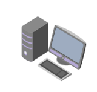
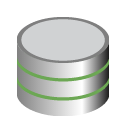
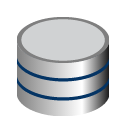
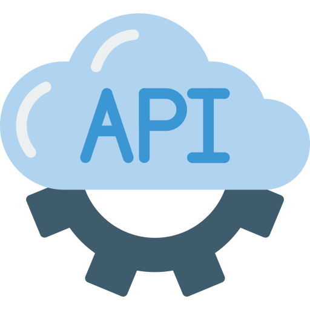
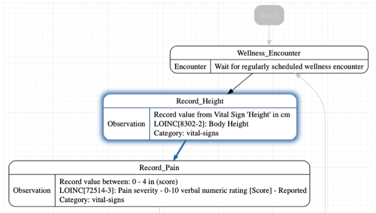
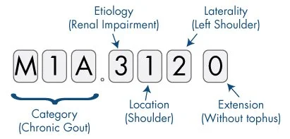

# Part 1: EHR Data

## Overview of the EHR Technology Ecosystem
**At its core level, an electronic health record (EHR) is a digital version of a patient’s paper medical chart. EHRs are digital patient-centered records that make information securely available to authorized users.**

* EHRs are intended to be operated by a healthcare practice or system and consolidate inputs by multiple providers within that system including physicians from differing specialties, nurses, and more that engage with a patient over the time they are receiving care.  
* In an idealized implementation, an EHR may include all the key administrative clinical data relevant to that patient’s care received through the health system. This includes demographics, progress notes, problems, medications, vital signs, past medical history, immunizations, laboratory data and radiology reports. These data may be in the form of both structured data (e.g., lab results) or unstructured data (e.g., clinical notes). 
* In practice, even  EHRs connected across hospital systems may not be well integrated, and information may not be harmonized.  This situation can be made worse when an EHR system is customized in different settings (e.g., in different hospital systems, offices, etc.).  

!!! note "Note"
    Additionally, while initially a tool to facilitate electronic billing, an EHR system can increasingly go beyond standard clinical data collected in a provider’s office and can be inclusive of a broader, patient-centric view of their care. This may include incorporating data from external care providers, as well as integrating with clinical decision support and other supplemental data sources to enhance an understanding of a patient’s wellbeing.

### EHR Technical Architecture
To better understand the data elements contained in an EHR, it is important to understand the technical architecture of an EHR system. This section describes the major architectural components of an EHR system, and the interactions between these components.

 ||EHR System Component| Description |
 |--|---------|-----------------|
 || **User Interface** | The user interface (UI) is a fundamental component of almost any clinical application, and is used within an EHR to both enter and display patient health records.|
 || **Record Services** | Record services are a set of services for managing patient health records. Record services provide functions like entering data into health records, searching for and retrieving health records, querying or extracting data from health records, and communicating or exchanging health records with other systems or applications. Record services interact with other components in this model such as the UI. | 
|| **Terminology Services** | Terminology services are those services that directly manage the terminology resources. They include functions like querying concepts, relationships and reference sets, and installing or updating SNOMED CT from release files. | 
|| **API Services** | Application Program Interface (API) services are a set of services for managing exchange of patient health record information with external parties. These services interface closely with terminology and record services to package information for export, and ingest and unpack incoming information for internal storage and utilization. | 

Source [https://confluence.ihtsdotools.org/display/DOCCDS/2.1.+EHR+System+Architecture](https://confluence.ihtsdotools.org/display/DOCCDS/2.1.+EHR+System+Architecture){target=_blank}

## Access and Regulatory Considerations

**Given the highly sensitive nature of data potentially contained within the EHR, significant regulatory and programmatic considerations come into play.**

To learn more about PII, PHI, and HIPAA, please expand the clipboards below.

??? example "PII and PHI Information and Concerns"
    * Before potentially accessing EHR data, it is important to note that such information is considered highly sensitive and is subject to considerable safeguards. Specifically, much of the data contained within an EHR carries a legal designation of Personnally Identifiable Information (PII) and Protected Health Information (PHI).
    * PII is information that can be used to distinguish or trace an individual's identity, either alone or when combined with other personal or identifying information that is linked or linkable to a specific individual.
        * Source: Glossary of NIH Terms [https://grants.nih.gov/grants/glossary.htm#P](https://grants.nih.gov/grants/glossary.htm#P){target=_blank}
    * PHI is information that relates to:
        * the individual’s past, present or future physical or mental health or condition, 
        * the provision of health care to the individual, or 
        * the past, present, or future payment for the provision of health care to the individual, and that identifies the individual or for which there is a reasonable basis to believe it can be used to identify the individual.
	    * Individually identifiable health information includes many common identifiers (e.g., name, address, birth date, Social Security Number).
        * Source: [source: https://www.hhs.gov/hipaa/for-professionals/privacy/laws-regulations/index.html](https://www.hhs.gov/hipaa/for-professionals/privacy/laws-regulations/index.html){target=_blank}
    * It should be noted that often researchers will work with de-identified EHR data that has purposely been stripped of PII. This may negate specific privacy concerns but there are other, additional privacy protections and considerations for handling even de-identified data.
    * There could also be privacy issues if multiple records of the same individual are linked together to create a more robust dataset.
    * Read more about the privacy rule here: [ https://www.hhs.gov/sites/default/files/privacysummary.pdf](https://www.hhs.gov/sites/default/files/privacysummary.pdf){target=_blank}
    * Read more about privacy and security of health information here: [https://www.healthit.gov/sites/default/files/pdf/privacy/onc_privacy_and_security_chapter4_v1_022112.pdf](https://www.healthit.gov/sites/default/files/pdf/privacy/onc_privacy_and_security_chapter4_v1_022112.pdf){target=_blank}

??? example "HIPAA and other regulatory considerations"
    * The Health Insurance Portability and Accountability Act of 1996 (HIPAA), and the Standards for Privacy of Individually Identifiable Health Information (Privacy Rule) issued by the US Department of Health and Human Services (HHS) to implement it, protects all "individually identifiable health information" held or transmitted by a covered entity or its business associate, in any form or media, whether electronic, paper, or oral.
        Source: Glossary of NIH Terms [https://grants.nih.gov/grants/glossary.htm#H](https://grants.nih.gov/grants/glossary.htm#H){target=_blank}
    * Several central tenets of the Privacy Rule are:
        * In general, authorized healthcare professionals may use or disclose protected health information for the purposes of treatment, payment, and health care operations without obtaining a patient’s written permission.
	* For other purposes, including research, one may need to obtain an individual’s authorization to use PHI.
	* Accessing PHI from a third-party institution will likely require  formalized business associate arrangement or data use agreements that must require all parties to comply with HIPAA, including breach notification requirements.
	* Generally, access to, use of, and disclosure of protected health information must be kept to the minimum necessary to carry out an action. This is called the “minimum necessary rule.”
        * Source: [https://www.healthit.gov/sites/default/files/pdf/privacy/onc_privacy_and_security_chapter4_v1_022112.pdf](https://www.healthit.gov/sites/default/files/pdf/privacy/onc_privacy_and_security_chapter4_v1_022112.pdf){target=_blank}

    * There are also concerns about discrimination based on healthcare data that have resulted in regulatory protections. One such example is The Genetic Information Nondiscrimination Act (GINA) of 2008 which protects Americans from discrimination based on their genetic information in both health insurance (Title I) and employment (Title II). Source: [https://www.genome.gov/about-genomics/policy-issues/Genetic-Discrimination](https://www.genome.gov/about-genomics/policy-issues/Genetic-Discrimination){target=_blank}

## Data Composition

The information contained in an EHR record can often be traced to a patient’s flow through the medical system. While each patient encounter may vary drastically based on the encounter type and the severity of the patient’s condition, we will explore the types of data in an EHR through the use-case of a typical annual wellness encounter (i.e., an annual patient visit to a primary care physician). 

To illustrate this scenario, this exercise references the "Wellness Encounter" from the Synthea Module Builder to show one possible process flow. The tool allows users to view and customize several possible health care scenarios, charting the process flow, and the associated data elements that come out of each step in the process​.

Source: [https://synthetichealth.github.io/module-builder/#wellness_encounters](https://synthetichealth.github.io/module-builder/#wellness_encounters){target=_blank}

!!! note "Processes can vary drastically"
    It should also be noted that these steps are not always a uniformly linear progression as patients may cycle back and forth through varying steps depending on their particular set of circumstances.

We'll check out an example of a wellness encounter between a patient and their outpatient healthcare provider. 

Here we see the initialization of the wellness encounter with the patient receiving an initial screening.

The Provider begins by recording the patient’s height, which is captured as a Logical Observation Identifiers Names and Codes (LOINC) code (see [details on LOINC below](#loinc)).

In this case, height is recorded with the LOINC code of `8302-2` which is `Body Height`.

Next, the Provider inquires about the patient’s current pain level and again records the result as a LOINC code. In this case, pain is recorded with the LOINC code of `72514-3` which has a human-readable description of `Pain Severity - 0-10 verbal numerical rating [Score] - Reported`.

Further down in the process flow we find our provider inquiring about the patient’s smoking status. 

Depending on the smoking status, we see that there are three options (in this example there are three, but more exist in the real world).
All three options use the same LOINC code `72166-2` with the human-readable description of `Tobacco smoking status` -- but each option has a different value. The LOINC standard has a preferred answer list for this question, but here our example represents the answers with one of three Systemized Nomenclature of Medicine – Clinical Terms or SNOMED CT® codes ([learn more about SNOMED-CT below](#snomed)), one where the smoker attribute is true, the second where the `quit smoking date` is not null, and finally 3, an `else` default finding:

1. SNOMED-CT `449868002` with the human-readable description `Smokes tobacco daily (finding)`

2. SNOMED-CT `8517006` with the human-readable description `Ex-smoker (finding)`

3. SNOMED-CT `266919005` with the human-readable description `Never smoked tobacco (finding)`

More generally, an EHR record will contain patient health information accumulated through this process, typically broken out by date, category, and information type. While the specific composition of this data can vary depending on EHR implementation, a reasonable example of data type and composition is available with the Synthea dataset.

It can be helpful to explore example EHR records in further detail to better understand what information they contain. In lieu of access to actual PHI, the Synthea project can come in handy to view specific data fields and associated elements.

Synthea, which has also produced the modeling tool we just used, is a Synthetic Patient Population Simulation that is used to generate synthetic patients. Synthea outputs synthetic, realistic (but not real) patient data and associated health records in a variety of formats. All the following screenshots are from Synthea, so remember, all data you’ll be viewing is synthetic and contains no actual PII.

??? example "To find out more about Synthea check here"
    * Synthea is a Synthetic Patient Population Simulation that is used to generate the synthetic patients. Synthea outputs synthetic, realistic (but not real) patient data and associated health records in a variety of formats.
    * Access Synthea project datasets here: [https://synthea.mitre.org/about](https://synthea.mitre.org/about){target=_blank}

### Sample EHR Data Exercise
The following exercise leverages synthetic data to explore some data elements contained in an EHR.

First let's look at the overall schema. Synthea’s EHR data is broken into a series of CSV files, each corresponding to a data table you might find in an EHR's relational database. 

If you want to see details on all available tables in Synthea check out the following:
??? example "Synthea Data Tables and Descriptions"
    | File | Description| 
    |---------|-----------------|
    |allergies.csv	|Patient allergy data|
    careplans.csv	|Patient care plan data, including goals.	
    claims.csv	|Patient claim data.	
    claims_transactions.csv	|Transactions per line item per claim.	
    conditions.csv	|Patient conditions or diagnoses.	
    devices.csv	|Patient-affixed permanent and semi-permanent devices.	
    encounters.csv	|Patient encounter data.	
    imaging_studies.csv	|Patient imaging metadata.	
    immunizations.csv	|Patient immunization data.	
    medications.csv	|Patient medication data.	
    observations.csv	|Patient observations including vital signs and lab reports.	
    organizations.csv	|Provider organizations including hospitals.	
    patients.csv	|Patient demographic data.	
    payer_transitions.csv	|Payer Transition data (i.e. changes in health insurance).	
    payers.csv	|Payer organization data.	
    procedures.csv	|Patient procedure data including surgeries.	
    providers.csv	|Clinicians that provide patient care.	
    supplies.csv	|Supplies used in the provision of care.	

For example, in an EHR, we might view a list of patients as a table:

??? example "Patients Table"
    |Id                                  |BIRTHDATE |DEATHDATE|SSN        |DRIVERS  |PASSPORT  |PREFIX|FIRST     |LAST        |SUFFIX|MAIDEN        |MARITAL|RACE |ETHNICITY  |GENDER|BIRTHPLACE                      |ADDRESS                        |CITY         |STATE     |COUNTY               |ZIP  |LAT               |LON                |HEALTHCARE_EXPENSES|HEALTHCARE_COVERAGE|
    |------------------------------------|----------|---------|-----------|---------|----------|------|----------|------------|------|--------------|-------|-----|-----------|------|--------------------------------|-------------------------------|-------------|----------|---------------------|-----|------------------|-------------------|-------------------|-------------------|
    |42574859-0c77-3889-9b2e-d5476bd0cbd6|2017-08-04|         |999-20-7307|         |          |      |Torie475  |Effertz744  |      |              |       |black|nonhispanic|F     |Concord  California  US         |585 Olson Neck Apt 22          |Oakley       |California|Contra Costa County  |94561|37.974941339405255|-121.64559719784606|75225.57           |65.28              |
    |38b9dfb6-29f6-60c8-ef37-6210064feac0|2001-12-22|         |999-72-8255|S99955340|X28520028X|Ms.   |Micaela928|Castañeda925|      |              |       |white|hispanic   |F     |Roseau  Saint George  DM        |905 Kuvalis Lane Suite 6       |Los Angeles  |California|Los Angeles County   |90077|34.17799692198641 |-118.45345768459985|519801.03          |354.99             |
    |cc837cec-8d1b-31d3-ff1b-4554b32bce35|2002-10-04|         |999-71-4536|S99991837|          |Ms.   |Lorinda137|Ankunding277|      |              |       |white|nonhispanic|F     |Glendora  California  US        |1040 Hintz Fork Suite 42       |Alpaugh      |California|Tulare County        |93201|35.85467564565039 |-119.49516206503664|67434.37           |105532.46          |
    |db56e012-d085-bc77-be8d-b2cb7540f813|1994-11-07|         |999-40-5557|S99975480|X18819519X|Mrs.  |Keisha459 |Walsh511    |      |Heidenreich818|M      |asian|nonhispanic|F     |Huntington Beach  California  US|227 Abernathy Boulevard Unit 19|San Francisco|California|San Francisco County |94111|37.78431771268959 |-122.44773848994711|937646.90          |99.97              |
    |cc1c0787-b215-3ce4-ef57-41c4b7169434|1973-08-27|         |999-31-9860|S99990549|X13756124X|Mr.   |Dana512   |Nitzsche158 |      |              |M      |white|hispanic   |M     |American Canyon  California  US |787 Ernser Walk                |Santa Clarita|California|Los Angeles County   |91355|34.4617083155669  |-118.56212511979317|1740481.36         |8317.76            |
    |d4321c71-bdaa-4085-61a1-43cfd876afdc|1990-11-19|         |999-90-7254|S99919958|X69927630X|Mr.   |Frances376|Lynch190    |      |              |M      |asian|nonhispanic|M     |Salinas  California  US         |227 McClure Skyway             |Santa Rosa   |California|Sonoma County        |95403|38.46180438357993 |-122.72061413299186|860907.41          |459.33             |
    |bf494d2b-8dcf-b448-92c0-a9bb496ad81c|1970-04-16|         |999-57-3297|S99966587|X21870103X|Mr.   |Roberto515|Ferrer164   |      |              |M      |white|hispanic   |M     |Caguas  Puerto Rico  PR         |117 Gleason Mission            |Long Beach   |California|Los Angeles County   |90713|33.825405425893045|-118.16523195240173|1294493.97         |4725.56            |
    |19543ef9-644c-1c9d-d0d5-e0fcec4670da|1985-06-11|         |999-90-3002|S99931470|X2800981X |Mrs.  |Omega729  |Trantow673  |      |Hessel84      |M      |white|hispanic   |F     |Torrance  California  US        |318 Schaden Manor              |Phelan       |California|San Bernardino County|92371|34.434310800795046|-117.5878097238367 |1981802.53         |22848.21           |
    |e5bffa4c-f113-e154-28ec-5dd5a51efc74|1999-06-20|         |999-10-3386|S99980475|X214587X  |Ms.   |Raeann749 |Hauck852    |      |              |       |white|nonhispanic|F     |Sausalito  California  US       |411 Feil Well Suite 13         |Malaga       |California|Fresno County        |     |36.65117620339231 |-119.74924813381965|904124.12          |4949.56            |
    |43a16fb4-b96c-b481-4fa0-c9c39c130224|1957-08-12|         |999-57-9595|S99953108|X81604053X|Mrs.  |Jolanda321|Flatley871  |      |Zieme486      |M      |white|nonhispanic|F     |Rocklin  California  US         |541 Wintheiser Avenue Unit 42  |Beaumont     |California|Riverside County     |92223|33.781281235931075|-116.90570546282912|1630601.76         |428479.92          |

We can see demographic data about these patients. Don’t worry, these are synthetic patients.

Each patient also has a list of Encounters (these are the visits) where they received care. For example:
??? example "Encounters Table"
    |Id                                  |START     |STOP                |PATIENT    |ORGANIZATION|PROVIDER  |PAYER|ENCOUNTERCLASS|CODE        |DESCRIPTION                                                     |BASE_ENCOUNTER_COST|TOTAL_CLAIM_COST|PAYER_COVERAGE|REASONCODE |REASONDESCRIPTION|
    |------------------------------------|----------|--------------------|-----------|------------|----------|-----|--------------|------------|----------------------------------------------------------------|-------------------|----------------|--------------|-----------|-----------------|
    |1988a1e8-be1c-f376-0947-e6ef3d851706|2017-08-04T14:30:14Z|2017-08-04T14:45:14Z|42574859-0c77-3889-9b2e-d5476bd0cbd6|f4fb0326-c6ce-34f2-96fc-451af75cdde9|65d369aa-dc8d-3a67-a054-e8e2e5148c91|42c4fca7-f8a9-3cd1-982a-dd9751bf3e2a|wellness      |410620009   |Well child visit (procedure)                                    |146.76             |402.69          |0.00          |           |                 |
    |43f55900-14f6-4310-440b-c34398531881|2013-01-05T15:06:33Z|2013-01-05T15:21:33Z|38b9dfb6-29f6-60c8-ef37-6210064feac0|d93b6804-6ca1-345d-a334-3e497b52e0f7|3ac820b9-b38e-304b-b9b6-8958ad2ffc63|4d71f845-a6a9-3c39-b242-14d25ef86a8d|wellness      |410620009   |Well child visit (procedure)                                    |146.76             |1629.70         |0.00          |           |                 |
    |e6b49657-1b8a-a3f8-ba68-abfb7ceb8429|2017-09-08T14:30:14Z|2017-09-08T14:45:14Z|42574859-0c77-3889-9b2e-d5476bd0cbd6|f4fb0326-c6ce-34f2-96fc-451af75cdde9|65d369aa-dc8d-3a67-a054-e8e2e5148c91|42c4fca7-f8a9-3cd1-982a-dd9751bf3e2a|wellness      |410620009   |Well child visit (procedure)                                    |146.76             |826.98          |0.00          |           |                 |
    |43756071-53a9-c553-9e53-d5579d869a59|2014-01-11T15:06:33Z|2014-01-11T15:21:33Z|38b9dfb6-29f6-60c8-ef37-6210064feac0|d93b6804-6ca1-345d-a334-3e497b52e0f7|3ac820b9-b38e-304b-b9b6-8958ad2ffc63|d47b3510-2895-3b70-9897-342d681c769d|wellness      |410620009   |Well child visit (procedure)                                    |146.76             |1645.25         |0.00          |           |                 |
    |3dfe4128-1081-13b3-5157-0708939fb2f9|2015-01-17T15:06:33Z|2015-01-17T15:21:33Z|38b9dfb6-29f6-60c8-ef37-6210064feac0|d93b6804-6ca1-345d-a334-3e497b52e0f7|3ac820b9-b38e-304b-b9b6-8958ad2ffc63|5059a55e-5d6e-34d1-b6cb-d83d16e57bcf|wellness      |410620009   |Well child visit (procedure)                                    |146.76             |1019.26         |0.00          |           |                 |
    |39ee963b-e4dd-e869-1fc3-662aab3b2bb0|2016-01-23T15:06:33Z|2016-01-23T15:21:33Z|38b9dfb6-29f6-60c8-ef37-6210064feac0|d93b6804-6ca1-345d-a334-3e497b52e0f7|3ac820b9-b38e-304b-b9b6-8958ad2ffc63|5059a55e-5d6e-34d1-b6cb-d83d16e57bcf|wellness      |410620009   |Well child visit (procedure)                                    |146.76             |883.26          |0.00          |           |                 |
    |8ced2121-b15e-8d4b-4734-a7ee3a40db1a|2017-11-10T14:30:14Z|2017-11-10T14:45:14Z|42574859-0c77-3889-9b2e-d5476bd0cbd6|f4fb0326-c6ce-34f2-96fc-451af75cdde9|65d369aa-dc8d-3a67-a054-e8e2e5148c91|42c4fca7-f8a9-3cd1-982a-dd9751bf3e2a|wellness      |410620009   |Well child visit (procedure)                                    |146.76             |1442.36         |0.00          |           |                 |
    |b2cc5208-4d02-7cd1-6032-a06920d4b106|2017-01-28T15:06:33Z|2017-01-28T15:21:33Z|38b9dfb6-29f6-60c8-ef37-6210064feac0|d93b6804-6ca1-345d-a334-3e497b52e0f7|3ac820b9-b38e-304b-b9b6-8958ad2ffc63|4d71f845-a6a9-3c39-b242-14d25ef86a8d|wellness      |410620009   |Well child visit (procedure)                                    |146.76             |1350.13         |0.00          |           |                 |
    |bb11eefe-e1b3-1595-9700-dd4e1b3258e0|2018-01-12T14:30:14Z|2018-01-12T14:45:14Z|42574859-0c77-3889-9b2e-d5476bd0cbd6|f4fb0326-c6ce-34f2-96fc-451af75cdde9|65d369aa-dc8d-3a67-a054-e8e2e5148c91|42c4fca7-f8a9-3cd1-982a-dd9751bf3e2a|wellness      |410620009   |Well child visit (procedure)                                    |146.76             |826.76          |65.28         |           |                 |
    |258df7cd-c3fd-9446-4e7a-3028bfadf3cc|2017-10-25T22:06:33Z|2017-10-25T22:21:33Z|38b9dfb6-29f6-60c8-ef37-6210064feac0|7dbe8a71-ceef-3e3e-b99e-fc3d1b5921a1|04fddee1-adc9-3f08-9e90-dac1b01cf48f|4d71f845-a6a9-3c39-b242-14d25ef86a8d|ambulatory    |185345009   |Encounter for symptom                                           |82.02              |87.68           |0.00          |10509002   |Acute bronchitis (disorder)|

In these examples, the Encounters have a CODE (a structured set of alpha-numeric patterns that map to detailed information such as diagnoses, procedures, etc.) with a corresponding description. Some of these Encounters also have a REASONCODE. Both codes use SNOMED CT (see [details on SNOMED CT below](#snomed-ct)). These are mainly used for diagnosis, procedure tracking, and symptom monitoring purposes within a healthcare setting.  The better documented "encounters" can also provide a wealth of information retrospectively for understanding etiology of diseases or can be used for epidemiological studies (e.g., hospital acquired infections or infection control and containment).

Patients also have a list of Conditions or Diagnoses. For example:
??? example "Diagnoses Table"
    |START                               |STOP      |PATIENT             |ENCOUNTER  |CODE     |DESCRIPTION|
    |------------------------------------|----------|--------------------|-----------|---------|-----------|
    |2016-01-23                          |2017-01-28|38b9dfb6-29f6-60c8-ef37-6210064feac0|39ee963b-e4dd-e869-1fc3-662aab3b2bb0|160968000|Risk activity involvement (finding)|
    |2017-10-25                          |2017-11-11|38b9dfb6-29f6-60c8-ef37-6210064feac0|258df7cd-c3fd-9446-4e7a-3028bfadf3cc|10509002 |Acute bronchitis (disorder)|
    |2018-03-23                          |2018-04-17|38b9dfb6-29f6-60c8-ef37-6210064feac0|4a5fc869-345d-8cc0-e0f8-daf14cc5635e|444814009|Viral sinusitis (disorder)|
    |2019-01-26                          |2019-07-12|42574859-0c77-3889-9b2e-d5476bd0cbd6|ea468580-5bda-25e8-8a84-efdc02c0afc7|65363002 |Otitis media|
    |2019-08-04                          |2019-08-04|42574859-0c77-3889-9b2e-d5476bd0cbd6|b39b04fd-afce-4d7a-7ec1-9d2d483bfae3|91861009 |Acute myeloid leukemia  disease (disorder)|
    |2019-08-04                          |2019-08-04|42574859-0c77-3889-9b2e-d5476bd0cbd6|1455e3d7-31ef-58c7-9d8f-420d8efd2db3|409089005|Febrile neutropenia (disorder)|
    |2019-08-04                          |2019-08-04|42574859-0c77-3889-9b2e-d5476bd0cbd6|1455e3d7-31ef-58c7-9d8f-420d8efd2db3|5758002  |Bacteremia (finding)|
    |2020-02-22                          |2020-03-03|42574859-0c77-3889-9b2e-d5476bd0cbd6|d3460ec9-1d24-487c-51bf-23e97219111d|195662009|Acute viral pharyngitis (disorder)|
    |2020-03-01                          |2020-03-27|42574859-0c77-3889-9b2e-d5476bd0cbd6|110756a8-a06b-285d-c7de-5aa411585fd5|444814009|Viral sinusitis (disorder)|
    |2020-08-02                          |2020-08-20|42574859-0c77-3889-9b2e-d5476bd0cbd6|adfbf7e0-8d90-ad8d-d9c1-1e7bf02f9ea2|444814009|Viral sinusitis (disorder)|

In these examples, we see each condition or diagnosis has a CODE. Again, these examples use SNOMED CT codes, but other common terminologies include International Statistical Classification of Diseases and Related Health Problems (Tenth Revision) (ICD-10). We can see from the descriptions that some of these codes are clinical diagnoses, such as Hyperlipidemia, a history of Stroke, and Diabetic Retinopathy. However, some of these data points can also be Social Determinants of Health (SDoH) such as stress, limited social contact, and social isolation.

During an Encounter, the clinical staff may perform Procedures on patients, which are recorded with CODEs. Some of these procedures also document a REASONCODE. These examples use SNOMED CT codes, but other common terminologies to encode procedures include Current Procedural Terminology (CPT) and Healthcare Common Procedure Coding System (HCPCS).
??? example "Procedures Table"
    |START                               |STOP      |PATIENT             |ENCOUNTER  |CODE     |DESCRIPTION|BASE_COST|REASONCODE|REASONDESCRIPTION                         |
    |------------------------------------|----------|--------------------|-----------|---------|-----------|---------|----------|------------------------------------------|
    |2013-01-05T15:06:33Z                |2013-01-05T15:21:33Z|38b9dfb6-29f6-60c8-ef37-6210064feac0|43f55900-14f6-4310-440b-c34398531881|430193006|Medication Reconciliation (procedure)|819.01   |          |                                          |
    |2014-01-11T15:06:33Z                |2014-01-11T15:17:17Z|38b9dfb6-29f6-60c8-ef37-6210064feac0|43756071-53a9-c553-9e53-d5579d869a59|171207006|Depression screening (procedure)|600.50   |          |                                          |
    |2014-01-11T15:06:33Z                |2014-01-11T15:21:33Z|38b9dfb6-29f6-60c8-ef37-6210064feac0|43756071-53a9-c553-9e53-d5579d869a59|430193006|Medication Reconciliation (procedure)|625.99   |          |                                          |
    |2014-01-11T15:17:17Z                |2014-01-11T15:37:26Z|38b9dfb6-29f6-60c8-ef37-6210064feac0|43756071-53a9-c553-9e53-d5579d869a59|715252007|Depression screening using Patient Health Questionnaire Nine Item score (procedure)|43.04    |          |                                          |
    |2014-01-11T15:37:26Z                |2014-01-11T15:51:39Z|38b9dfb6-29f6-60c8-ef37-6210064feac0|43756071-53a9-c553-9e53-d5579d869a59|428211000124100|Assessment of substance use (procedure)|600.50   |          |                                          |
    |2014-01-11T15:51:39Z                |2014-01-11T16:19:37Z|38b9dfb6-29f6-60c8-ef37-6210064feac0|43756071-53a9-c553-9e53-d5579d869a59|868187001|Assessment using Car  Relax  Alone  Forget  Friends  Trouble Screening Test (procedure)|600.50   |          |                                          |
    |2014-01-11T16:19:37Z                |2014-01-11T16:33:57Z|38b9dfb6-29f6-60c8-ef37-6210064feac0|43756071-53a9-c553-9e53-d5579d869a59|386516004|Anticipatory guidance (procedure)|600.50   |          |                                          |
    |2015-01-17T15:06:33Z                |2015-01-17T15:19:22Z|38b9dfb6-29f6-60c8-ef37-6210064feac0|3dfe4128-1081-13b3-5157-0708939fb2f9|428211000124100|Assessment of substance use (procedure)|600.50   |          |                                          |
    |2015-01-17T15:19:22Z                |2015-01-17T15:32:51Z|38b9dfb6-29f6-60c8-ef37-6210064feac0|3dfe4128-1081-13b3-5157-0708939fb2f9|868187001|Assessment using Car  Relax  Alone  Forget  Friends  Trouble Screening Test (procedure)|600.50   |          |                                          |
    |2015-01-17T15:32:51Z                |2015-01-17T15:38:38Z|38b9dfb6-29f6-60c8-ef37-6210064feac0|3dfe4128-1081-13b3-5157-0708939fb2f9|386516004|Anticipatory guidance (procedure)|600.50   |          |                                          |

Other common data elements include medications, either administered or prescribed, and diagnostic lab results and vital sign measurements. Sometimes the measurements and results are called Observations.
??? example "Medications Table"
    |START                               |STOP      |PATIENT             |PAYER      |ENCOUNTER|CODE      |DESCRIPTION|DISPENSES |REASONCODE  |REASONDESCRIPTION                                               |
    |------------------------------------|----------|--------------------|-----------|---------|----------|-----------|----------|------------|----------------------------------------------------------------|
    |10/25/17                            |11/11/17  |38b9dfb6            |4d71f845   |258df7cd |313782    |Acetaminophen 325 MG Oral Tablet|1         |10509002    |Acute bronchitis (disorder)                                     |
    |12/11/17                            |12/6/18   |38b9dfb6            |4d71f845   |dab2c529 |748879    |Levora 0.15/30 28 Day Pack|12        |            |                                                                |
    |12/26/18                            |          |42574859            |b1c428d6   |f8878c7e |1014676   |cetirizine hydrochloride 5 MG Oral Tablet|41        |            |                                                                |
    |12/26/18                            |          |42574859            |b1c428d6   |f8878c7e |1870230   |NDA020800 0.3 ML Epinephrine 1 MG/ML Auto-Injector|41        |            |                                                                |
    |1/26/19                             |2/9/19    |42574859            |b1c428d6   |ea468580 |313820    |Acetaminophen 160 MG Chewable Tablet|1         |            |                                                                |
    |12/1/19                             |11/25/20  |38b9dfb6            |42c4fca7   |f6bae05e |1367439   |NuvaRing 0.12/0.015 MG per 24HR 21 Day Vaginal Ring|12        |            |                                                                |
    |8/4/19                              |8/4/19    |42574859            |4d71f845   |1455e3d7 |199885    |levofloxacin 500 MG Oral Tablet|1         |91861009    |Acute myeloid leukemia  disease (disorder)                      |
    |3/3/21                              |3/17/21   |42574859            |4d71f845   |ac66a7e2 |308192    |Amoxicillin 500 MG Oral Tablet|1         |            |                                                                |
    |3/3/21                              |3/17/21   |42574859            |4d71f845   |ac66a7e2 |198405    |Ibuprofen 100 MG Oral Tablet|1         |            |                                                                |
    |11/25/20                            |11/20/21  |38b9dfb6            |047f6ec3   |6744ffa1 |751905    |Trinessa 28 Day Pack|12        |            |                                                                |

These medications include information about the patient, a CODE, often the REASONCODE for the medication, the number of dispenses, and other information. In these examples, the CODEs used are RxNorm codes, and the REASONCODES are SNOMED CT.
??? example "Observations Table"
    |DATE                                |PATIENT   |ENCOUNTER           |CATEGORY   |CODE     |DESCRIPTION|VALUE   |UNITS    |TYPE                                      |
    |------------------------------------|----------|--------------------|-----------|---------|-----------|--------|---------|------------------------------------------|
    |2017-08-04T14:30:14Z                |42574859-0c77-3889-9b2e-d5476bd0cbd6|1988a1e8-be1c-f376-0947-e6ef3d851706|vital-signs|8302-2   |Body Height|53.5    |cm       |numeric                                   |
    |2017-08-04T14:30:14Z                |42574859-0c77-3889-9b2e-d5476bd0cbd6|1988a1e8-be1c-f376-0947-e6ef3d851706|vital-signs|72514-3  |Pain severity - 0-10 verbal numeric rating [Score] - Reported|3.0     |{score}  |numeric                                   |
    |2017-08-04T14:30:14Z                |42574859-0c77-3889-9b2e-d5476bd0cbd6|1988a1e8-be1c-f376-0947-e6ef3d851706|vital-signs|29463-7  |Body Weight|4.1     |kg       |numeric                                   |
    |2017-08-04T14:30:14Z                |42574859-0c77-3889-9b2e-d5476bd0cbd6|1988a1e8-be1c-f376-0947-e6ef3d851706|vital-signs|77606-2  |Weight-for-length Per age and sex|18.6    |%        |numeric                                   |
    |2013-01-05T15:06:33Z                |38b9dfb6-29f6-60c8-ef37-6210064feac0|43f55900-14f6-4310-440b-c34398531881|vital-signs|8302-2   |Body Height|138.9   |cm       |numeric                                   |
    |2017-08-04T14:30:14Z                |42574859-0c77-3889-9b2e-d5476bd0cbd6|1988a1e8-be1c-f376-0947-e6ef3d851706|vital-signs|9843-4   |Head Occipital-frontal circumference|36.0    |cm       |numeric                                   |
    |2013-01-05T15:06:33Z                |38b9dfb6-29f6-60c8-ef37-6210064feac0|43f55900-14f6-4310-440b-c34398531881|vital-signs|72514-3  |Pain severity - 0-10 verbal numeric rating [Score] - Reported|1.0     |{score}  |numeric                                   |
    |2017-08-04T14:30:14Z                |42574859-0c77-3889-9b2e-d5476bd0cbd6|1988a1e8-be1c-f376-0947-e6ef3d851706|vital-signs|8462-4   |Diastolic Blood Pressure|71.0    |mm[Hg]   |numeric                                   |
    |2013-01-05T15:06:33Z                |38b9dfb6-29f6-60c8-ef37-6210064feac0|43f55900-14f6-4310-440b-c34398531881|vital-signs|29463-7  |Body Weight|28.0    |kg       |numeric                                   |
    |2017-08-04T14:30:14Z                |42574859-0c77-3889-9b2e-d5476bd0cbd6|1988a1e8-be1c-f376-0947-e6ef3d851706|vital-signs|8480-6   |Systolic Blood Pressure|119.0   |mm[Hg]   |numeric                                   |

An Observations table might look like the above. This table contains several different CATEGORIES of data, for example, vital-signs, laboratory, social-history, and survey data. Each data element has a CODE, description, value, and units of measure. In this example, the CODE is using LOINC, and the units of measure are using Unified Code for Units of Measure (UCUM).

!!! note "Note:"
    Take a special look at one “social-history” observation in the table that records a patient smoking status. We’ll talk about this more when we discuss USCDI in the next section.

In an EHR system, this structured data can be shown in a consolidated patient view (as opposed to a set of different tables). In an EHR, the patient record could also include unstructured clinical notes. A very rudimentary and abridged example of an unstructured clinical note may look like this:

> Cecil300 is a 50 year-old non-Hispanic white male. Patient has a history of acute bacterial sinusitis, part-time employment , limited social contact, reports of violence in the environment, social isolation, and stress. Patient is single. Patient is an active smoker and is an alcoholic. Patient identifies as heterosexual. Patient comes from a high socioeconomic background and has completed some college courses. Patient currently has coverage through Friendly Insurance Company. No Known Allergies. No Active Medications. Cecil300 presents to the office with a chief complaint of "sore throat for one week." Patient reports that his sore throat began last Saturday, and has been getting worse since then. He reports that his throat is very sore and it hurts to swallow. He has also developed a fever of 101 degrees Fahrenheit and a headache. He denies any other symptoms, including cough, runny nose, or congestion. He reports that he has been taking ibuprofen and drinking lots of fluids, but his symptoms have not improved.

So, now you’ve seen some codes from different terminologies like SNOMED CT, LOINC, and RxNorm.  You’ve also seen some unstructured data as shown in the clinical note example. Let’s dive a little deeper into these codes and terminologies in the next section.

## Codes and Medical Terminology

**When dealing with EHR data you will likely encounter two types: structured and unstructured.**

* Unstructured data, typically taking the form of encounter notes, audio, video, or image files, has its own set of significant challenges, and will be out of scope for this tutorial.
* Structured data, in-contrast, is, as the name suggests, restricted to heavily formatted data types and structures. This could include text fields like name, regular-expressions, like phone number, and alpha-numeric coding terminology. 

Commonly used coding standards for structured data include:  **LOINC, CPT, SNOMED CT, ICD-10, and RxNorm, etc.**​ It is important to have a general understanding of these coding systems because they have become the standard for rendering structured data in an interoperable manner.

### LOINC

**Logical Observation Identifiers Names and Codes (LOINC®)**, is a proprietary clinical terminology that is important for laboratory test orders and results, and is one of a suite of designated standards for use in U.S. Federal Government systems for the electronic exchange of clinical health information. 

Managed by the Regenstrief Institute, LOINC has been identified by the Health Level 7 (HL7) Standards Development Organization as a preferred diagnostic report code set for laboratory test identification in transactions between health care facilities, laboratories, laboratory testing devices and public health authorities.

See here: [https://www.hl7.org/fhir/diagnosticreport-definitions.html#DiagnosticReport.code](https://www.hl7.org/fhir/diagnosticreport-definitions.html#DiagnosticReport.code){target=_blank}

LOINC codes are divided into Test Order and Test Result codes.

??? example "Test Order Code Structure and Examples"
    Test Order codes are 5 digit numeric codes appended with a dash and 6th number. Form: XXXXX-X

    e.g.,
        As an example, one of the more popular codes is: `2160-0` for `Creatinine [Mass/volume] in Serum or Plasma`
        Source:  [https://loinc.org/2160-0/](https://loinc.org/2160-0/){target=_blank}

    Additional attributes associated with LOINC test codes include:

    * LOINC code
    * Long Common Name
    * Status
    *Additional names
    * Class
    * Type
    * Order vs. Observation
    * Member of these panels
    * Member of these groups
    * Example Units

    e.g.,
    An example can be found here: [ https://loinc.org/69049-5/]( https://loinc.org/69049-5/){target=_blank} and further details here [https://loinc.org/kb/users-guide/introduction/](https://loinc.org/kb/users-guide/introduction/){target=_blank}

    |LOINC code|Long Common Name|Status|Additional names|Class|Type|Order vs. Observation|Member of these panels|Member of these groups|Example Units|
    |---------|-----------------|------------------|------------------|-------------|-----|-----|------|----|----|
    | 69049-5  | Coagulation specialist review of results | Active | Coagulation specialist review[Interp] | MISC | Laboratory | Observation| 93321-8	PT mixing study panel - Platelet poor plasma by Coagulation ass | | |

??? example "Test Result Code Structure and Examples"
    LOINC Test Result codes are also 5 digit numeric codes appended with a dash and 6th number. Form: XXXXX-X

    Additional attributes associated with LOINC Test Result codes are:

    * LOINC Values Updated
    * Test ID
    * Test Order Name
    * Result ID
    * Result LOINC Code
    * LOINC Attributes
    * Method Name

    | LOINC Values Updated | Test ID | Test Order Name | Result ID | Test Result Name| Result LOINC Code | LOINC Attributes | Method Name |
    |----------------------|---------|-----------------|-----------|-----------------|-------------------|------------------|-------------|
    | 2022-03-11 | CNSA | Central Nervous System Consultation, Autopsy, Varies | 71070 | Interpretation | 18743-5 | Autopsy report:Find:Pt:{Setting}:Doc:{Role} | Includes hermatoxylin and eosin stains. Additional special stains or procedures necessary for diagnosis will be billed separately. |
    
    Source: [https://loinc.org/kb/users-guide/introduction/](https://loinc.org/kb/users-guide/introduction/){target=_blank}

!!! danger "Additional Resource on LOINC codes"
    Additonal infomration on the **LOINC coding terminology** is available here: [https://loinc.org]( https://loinc.org){target=_blank}

??? question "Knowledge Check: Where would I look to find human-readable description of the specific LOINC code?"
    The `Test Order Name` attribute provides additional details on the specific LOINC code.

### CPT

**Current Procedural Terminology (CPT)** codes are assigned to each task and service a healthcare provider offers. They include medical, surgical, and diagnostic services. Insurers use CPT codes to determine how much money to pay a provider for a given task or service.

!!! Note "Code Similarities"
    CPT codes are also a subset of codes comprising the Healthcare Common Procedure Coding System (HCPCS) used for Medicare reimbursements.
    Source: [https://www.cms.gov/Medicare/Coding/MedHCPCSGenInfo](https://www.cms.gov/Medicare/Coding/MedHCPCSGenInfo){target=_blank}

CPT codes are developed, maintained, and copyrighted by the American Medical Association (AMA).

??? example "CPT Code Structure and Examples"
    A CPT code is a five-character code. Typically, most characters within the code are numbers without decimal marks. Some codes have four numbers and one letter.

    There are several categories of CPT codes, including:

    * **Category I:** Procedures, services, devices, and drugs, including vaccines
    * **Category II:** Performance measures and quality of care
    * **Category III:** Services and procedures using emerging technology
    * PLA codes, which are used for lab testing

    Here are some examples:

    * `99214` may be used for an office visit
    * `99397` may be used for a preventive exam if you are over 65
    * `90658` indicates a flu shot
    * `90716` may be used for the chickenpox vaccine (varicella)
    * `12002` may be used when a healthcare provider stitches up a 1-inch cut on your arm

It should also be noted that some CPT codes indicate bundled services. That is, one code describes several services performed together.

!!! danger "Additional Resources on CPT codes"
    * Updated list of codes: [https://www.cms.gov/Medicare/Fraud-and-Abuse/PhysicianSelfReferral](https://www.cms.gov/Medicare/Fraud-and-Abuse/PhysicianSelfReferral){target=_blank}
    * CPT code lookup tool: [https://www.aapc.com/codes/cpt-codes-range/](https://www.aapc.com/codes/cpt-codes-range/){target=_blank}

### SNOMED-CT
**Systemized Nomenclature of Medicine – Clinical Terms or SNOMED CT®** is a standardized, international, multilingual core set of clinical healthcare terminology that can be used in an EHR.

SNOMED International is the non-profit standards development organization that creates and distributes SNOMED CT, and it is operated by the International Health Standards Development Organization. The National Library of Medicine (NLM) is the release center for SNOMED CT in the United States and supports the distribution of SNOMED CT for United States users.

!!! note "SNOMED CT is a critical part of interoperability"
    SNOMED CT is one of a suite of designated standards for use in U.S. Federal Government systems for the electronic exchange of clinical health information and is also a required standard in interoperability specifications of the U.S. Healthcare Information Technology Standards Panel.

??? example "SNOMED CT Code Structure and Examples"
    SNOMED CT codes are numerical and are a minimum of six digits long.

    For instance, `271737000` is the code for anemia (disorder).
    A common procedural code is Renal dialysis (procedure) `265764009`.

!!! danger "Additional Resource on SNOMED CT codes"
    Resources and code lookups can be found here: [https://www.nlm.nih.gov/healthit/snomedct/index.html](https://www.nlm.nih.gov/healthit/snomedct/index.html){target=_blank}

### ICD-10
ICD-10 is the 10th revision of the **International Statistical Classification of Diseases and Related Health Problems (ICD)**, a medical classification list by the World Health Organization (WHO).

For disease reporting, the US utilizes its own national variant of ICD-10 called the ICD-10 Clinical Modification (ICD-10-CM). A procedural classification called ICD-10 Procedure Coding System (ICD-10-PCS) has also been developed for capturing inpatient procedures. The ICD-10-CM and ICD-10-PCS were developed by the Centers for Medicare and Medicaid Services (CMS) and the National Center for Health Statistics (NCHS).

??? example "ICD-10 Code Structure and Examples"
    ICD-10-CM codes may consist of up to seven digits, with the seventh digit extensions representing visit encounter or sequelae for injuries and external causes.

    
    
    source: [https://www.aapc.com/icd-10/conversion-mapping.aspx](https://www.aapc.com/icd-10/conversion-mapping.aspx){target=_blank}

    Example codes:

    * `E08.22`, Diabetes mellitus due to an underlying condition with diabetic chronic kidney disease  
    * `T81.535`, Perforation due to foreign body accidently left in body following heart catheterization  
    * Code extensions (seventh character) have been added for injuries and external causes to identify the encounter: initial, subsequent, or sequela. The extensions are:  
        * `A` Initial encounter  
        * `D` Subsequent encounter  
        * `S` Sequelae 

!!! danger "Additional Resources on ICD-10 codes"
    * [https://www.cms.gov/Medicare/Coding/ICD10](https://www.cms.gov/Medicare/Coding/ICD10){target=_blank}
    * ICD-10 CM Browser from the CDC: [https://icd10cmtool.cdc.gov](https://icd10cmtool.cdc.gov){target=_blank}
    * ICD Browser from the World Health Organization: [https://icd.who.int/browse10/2019/en](https://icd.who.int/browse10/2019/en){target=_blank}

### RxNorm
**RxNorm** is a normalized naming system for generic and branded drugs; it is a tool for supporting semantic interoperation between drug terminologies and pharmacy knowledge base systems. 

It does this by providing normalized names for clinical drugs and links its names to many of the drug vocabularies commonly used in pharmacy management and drug interaction software, including those of First Databank, Micromedex, and Gold Standard Drug Database. By providing links between these vocabularies, RxNorm can mediate messages between systems not using the same software and vocabulary.

The National Library of Medicine (NLM) produces RxNorm. Source: [https://www.nlm.nih.gov/research/umls/rxnorm/overview.html](https://www.nlm.nih.gov/research/umls/rxnorm/overview.html){target=_blank}

RxNorm also provides a set of codes for clinical drugs, which are the combination of active ingredients, dose form, and strength of a drug. 

For example, the most prescribed drug in the US is **Atorvastatin** (also known as Lipitor, to 24M Americans) to lower cholesterol. Its RXNorm code is `83367`. Sources: [https://clincalc.com/DrugStats/Drugs/Atorvastatin](https://clincalc.com/DrugStats/Drugs/Atorvastatin){target=_blank}, [https://mor.nlm.nih.gov/RxNav/search?searchBy=RXCUI&searchTerm=83367](https://mor.nlm.nih.gov/RxNav/search?searchBy=RXCUI&searchTerm=83367){target=_blank}

In the National Drug Code (NDC) system, if more than one manufacturer produces the same medication, each assigns different NDCs. In contrast, the RxNorm vocabulary creates standard names and identifiers for the combinations of ingredients, strengths, and dose forms.

!!! danger "Additional Resource on RxNorm codes"
    * [https://www.nih.gov/news-events/news-releases/drug-naming-standard-electronic-health-records-enhanced](https://www.nih.gov/news-events/news-releases/drug-naming-standard-electronic-health-records-enhanced){target=_blank}

!!! quote "Key Point: Why this matters:"
    **EHRs are a vast resource of information, chronicling each individual’s health. Significant work has gone into standardizing this information into a uniform set of coding terminologies with the aim of ensuring that health records can be interpreted across providers and patients. Understanding these terminologies and the information types contained within them is a critical first step to unlocking the potential research value of this data.**

??? question "Knowledge Check: What code systems are used to identify clinical measurements?"
    LOINC
??? question "Knowledge Check: What code systems are used to identify medications?"
    * RxNorm
    * NDC 
??? question "Knowledge Check: What code systems are used to identify procedures?"
    * CPT
    * HCPCS
    * SNOMED
??? question "Knowledge Check: What code systems are used to identify diagnoses?"
    * SNOMED
    * ICD-10